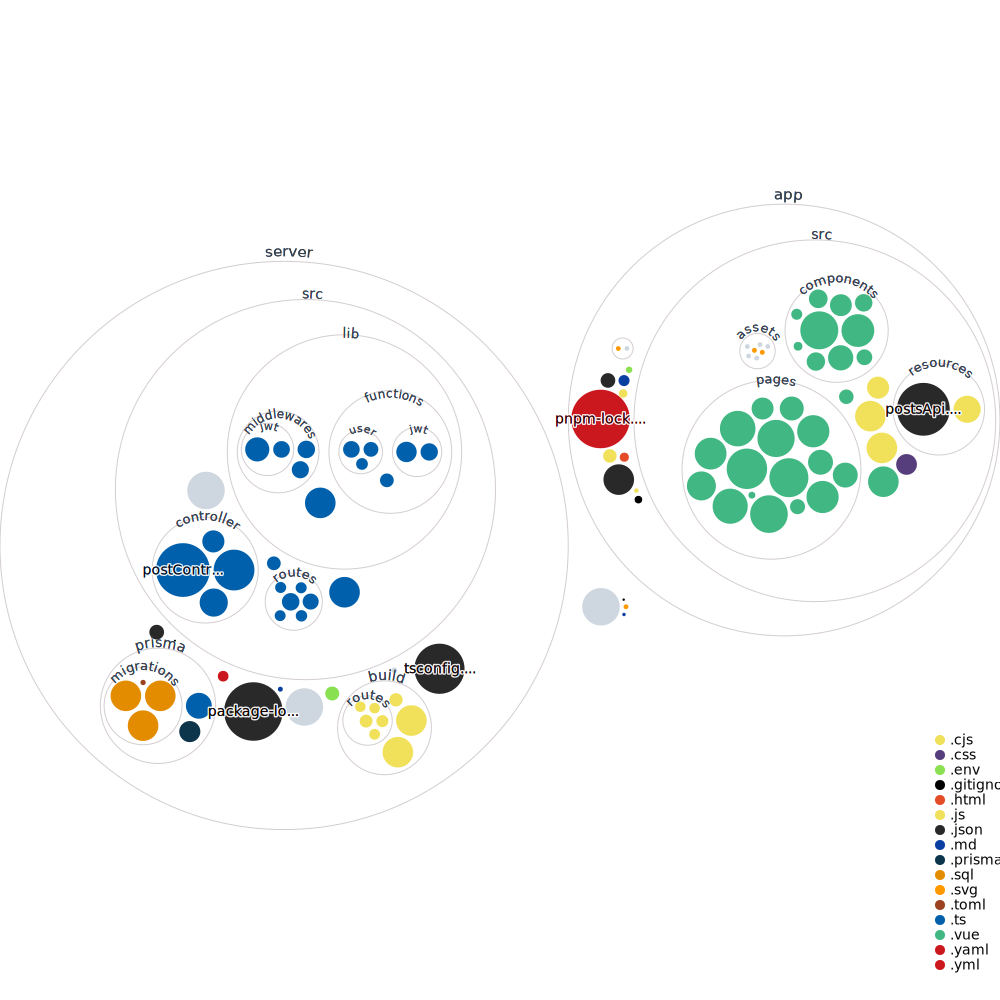

## Web-programming project
เว็บไซต์สำหรับเผยแพร่สรุปการเรียน หรือ เนื้อหาการเรียน ✨

---

### จัดทำโดย

| ชื่อ-นามสกุล | รหัสนักศึกษา |
| ----------- | ----------- |
| ยลรดี ประยูรพันธุ์รัตน์ | 64070089 |
| ศุภกร เนตรสุวรรณ | 64070108 |

---

### เครื่องมือที่ใช้
เครื่องมือที่มีการใช้งานหลักๆ ในโปรเจค ไม่รวมถึงเครื่องสำหรับสนับสนุนย่อยๆ (Library)
1. Vue.js
2. Express + Typescript (Node.js runtume for webserver)
3. Prisma (ORM)
4. MySQL

[ดูข้อมูล Visualize จาก Github action](https://mango-dune-07a8b7110.1.azurestaticapps.net/?repo=SupakornNetsuwan%2Fwebpro-project)

---

